# Test Task 

### Используемые технологии:

- Java 1.8
- Apache maven 3.6.3
- Vaadin 8.10.1

## Иструкция по установке:

    1. Скачайте или клонируйте из ветки (master) последний релиз.
    
    2. Пропишите в терминале путь к папке с проектом.
    
    3. Выполните команды: 
       - mvn package
       - mvn jetty:run
       
    4. Перейдите на сайт http://localhost:8080
    
    5. Готово!
    
## Пользовательский интерфейс:

    Главная страница:
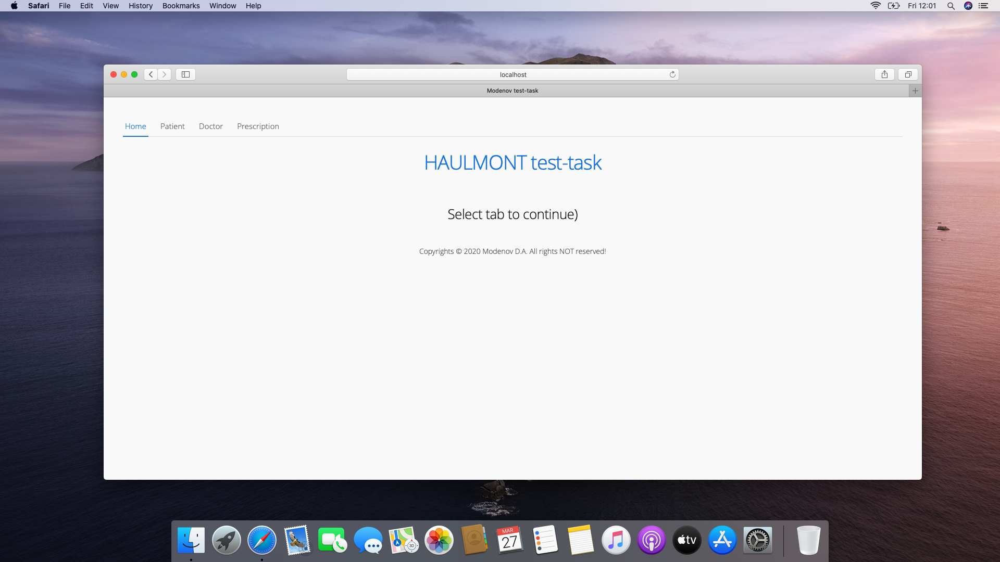

    Вкладка пациента:
    
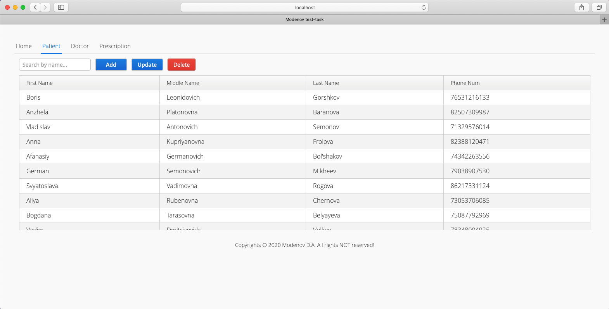

    Добавление нового пациента:
    
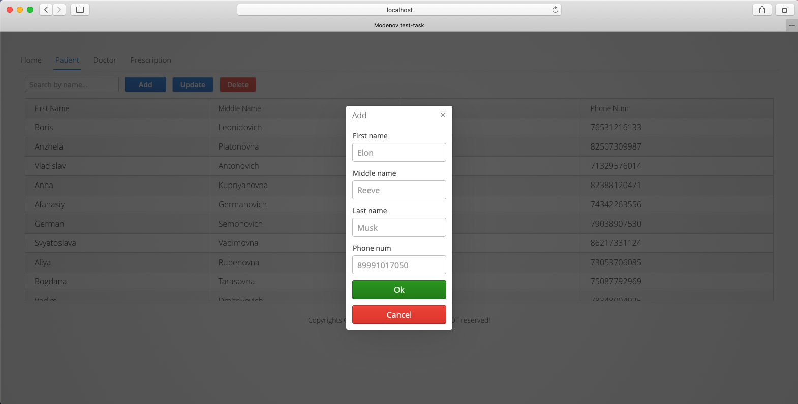

    Редактирование пациента:
    
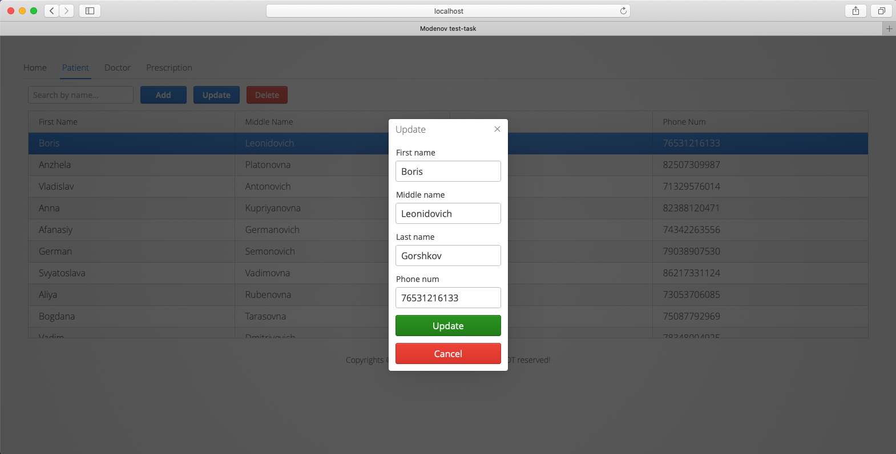

    Вкладка доктора:
    
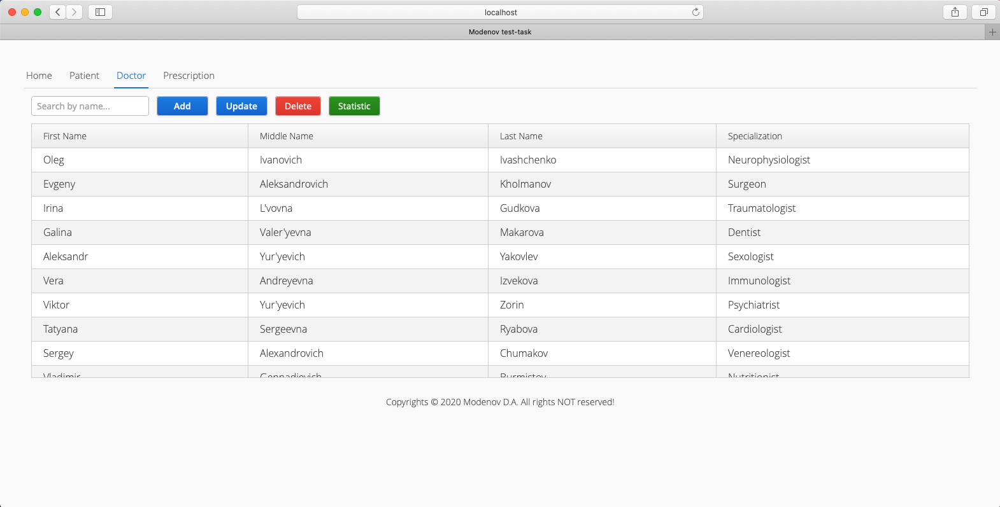

    Добавление нового доктора:
    
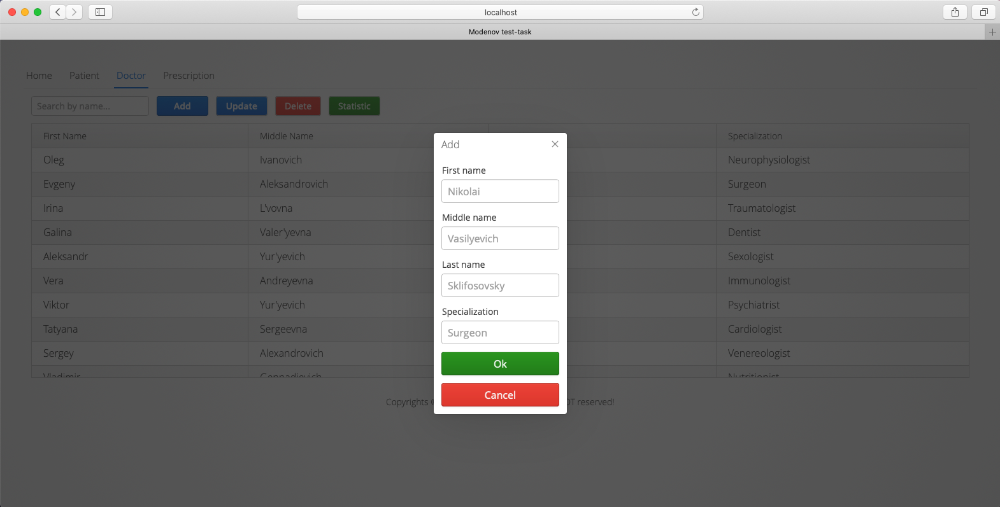

    Редактирование доктора:

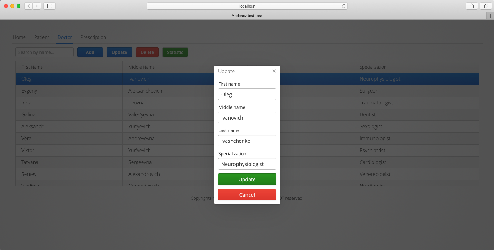

    Статистика по выписанным рецептам:

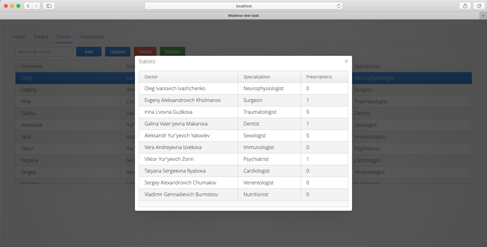

    Вкладка рецептов: 
    
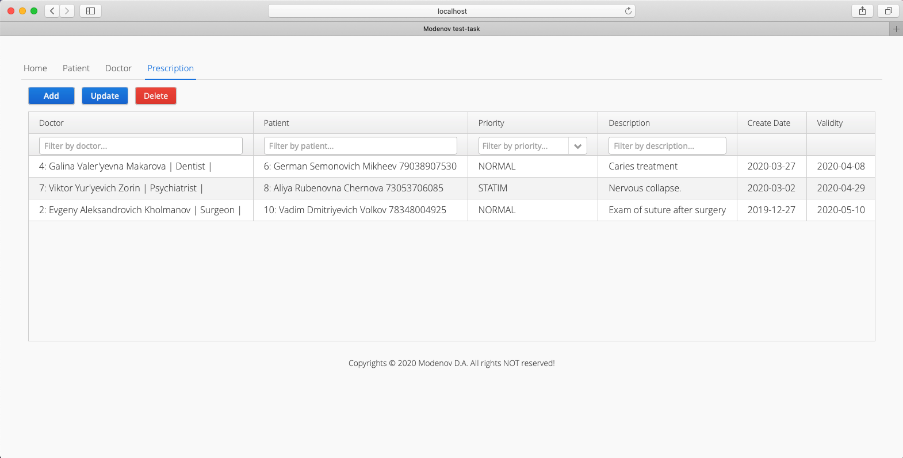    

    Добавление нового рецепта:
    
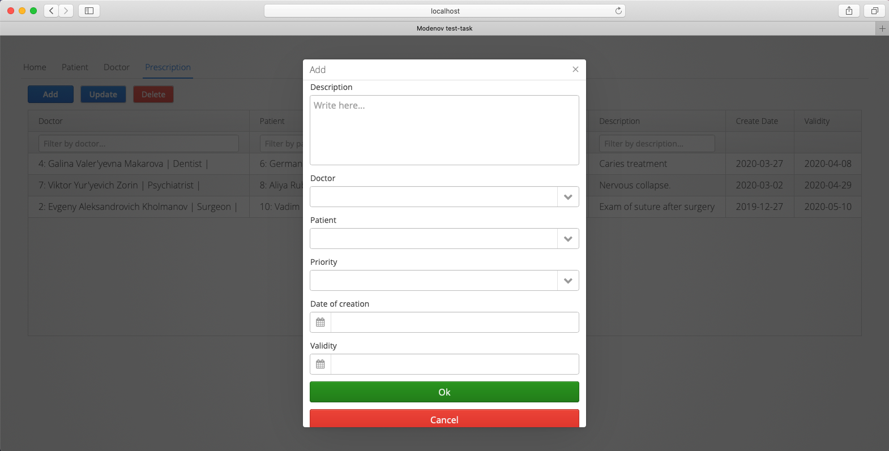

    Редактирование рецепта:
    
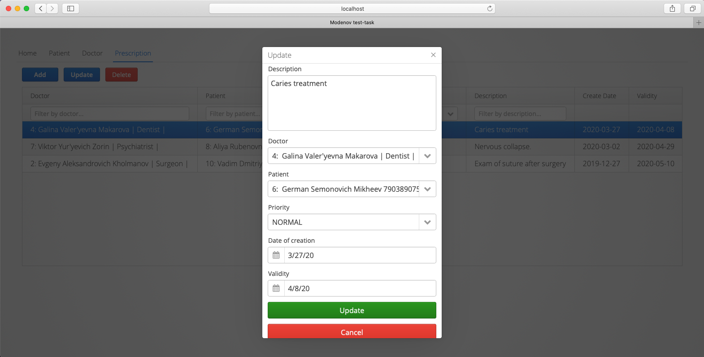 

### Приятного пользования!

---

# Требования к заданию:      

Данное тестовое задание должно в результате содержать работающее веб-приложение, удовлетворяющее всем 
нижеописанным требованиям, и качественный исходный код.

Задание должно быть выполнено полностью самостоятельно, не копируйте и не используйте код других соискателей.

Постарайтесь создать грамотную композицию классов и форматировать код в соответствии со стандартами Java.

Стандартный стиль форматирования Java: http://www.oracle.com/technetwork/java/codeconventions-150003.pdf

## Описание задачи

Реализовать систему ввода и отображения информации о рецептах поликлиники, включающую следующие сущности и их атрибуты:

 Пациент:

- Имя

- Фамилия

- Отчество

- Телефон

Врач:

- Имя

- Фамилия

- Отчество

- Специализация

Рецепт:

- Описание

- Пациент

- Врач

- Дата создания

- Срок действия

- Приоритет (Рецепт может иметь один из приоритетов: Нормальный, Cito (Срочный), Statim (Немедленный))

### Система должна иметь следующие функции:

- Отображение списка пациентов

- Добавление нового пациента, редактирование и удаление существующего

- Отображение списка врачей

- Отображение статистической информации по количеству рецептов, выписанных врачами

- Добавление нового врача, редактирование и удаление существующего

- Отображения списка рецептов

- Фильтрация списка рецептов по описанию, приоритету и пациенту

- Добавление нового рецепта, редактирование и удаление существующего

### Требования к реализации

 Используемые технологии:

- Java SE 8

- Пользовательский интерфейс на Vaadin 8 (https://vaadin.com)

- Доступ к данным через JDBC или JPA

- Не используйте JPAContainer из Vaadin. Ваш код доступа к данным должен быть абстрагирован от UI.

- Сервер баз данных: HSQLDB в in-process режиме (http://hsqldb.org/doc/2.0/guide/running-chapt.html#rgc_inprocess)

- Рекомендуется использовать шаблон проекта https://github.com/Haulmont/test-task

### Требования к пользовательскому интерфейсу:

 Экраны системы:

- Список пациентов: таблица, кнопки "Добавить", "Изменить", "Удалить"

- Редактирование пациента: поля ввода атрибутов, кнопки "OK", "Отменить"

- Список врачей: таблица, кнопки "Добавить", "Изменить", "Удалить", "Показать статистику"

- Редактирование врача: поля ввода атрибутов, кнопки "OK", "Отменить"

- Список рецептов с фильтром: таблица, кнопки "Добавить", "Изменить", "Удалить", панель фильтра с полями

- "Пациент", "Приоритет", "Описание" и кнопкой "Применить"

- Фильтр по описанию предполагает вывод рецептов, содержащих в описании введѐнный в фильтр текст

- Редактирование рецепта: поля ввода атрибутов, кнопки "ОК", "Отменить"

- Экраны редактирования должны быть модальными

- Все формы ввода должны валидировать данные в соответствии с их типом и допустимыми значениями

### Другие требования:

- Код доступа к данным должен быть изолирован в классах DAO.

- Каждая таблица должна иметь первичный ключ типа Long.

- Система должна иметь защиту на уровне БД от удаления пациента и врача, для которых существуют рецепты.

###  Готовое приложение должно содержать:

- Каталог с исходными текстами и проектным файлом Maven (pom.xml) 

- SQL скрипт создания таблиц в базе данных в виде отдельного файла проекта
 (Примечание: требуется SQL скрипт создания всех необходимых объектов в БД, написанный вручную)

- Файлы базы данных HSQLDB.

- Приложение должно подключаться к БД без необходимости старта отдельного сервера.

- Для запуска приложения должно быть достаточно собрать его при помощи Maven, как описано для шаблона
https://github.com/Haulmont/test-task.

